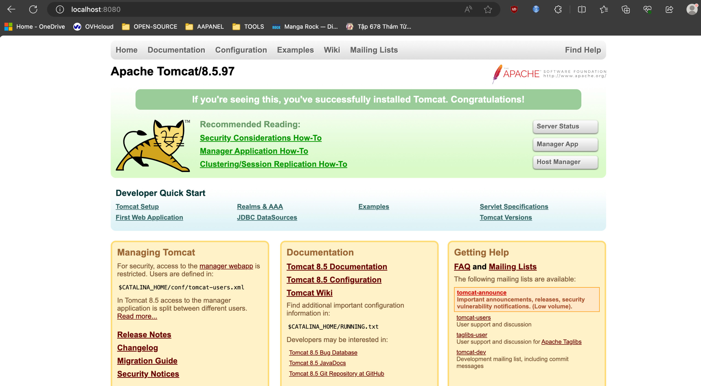
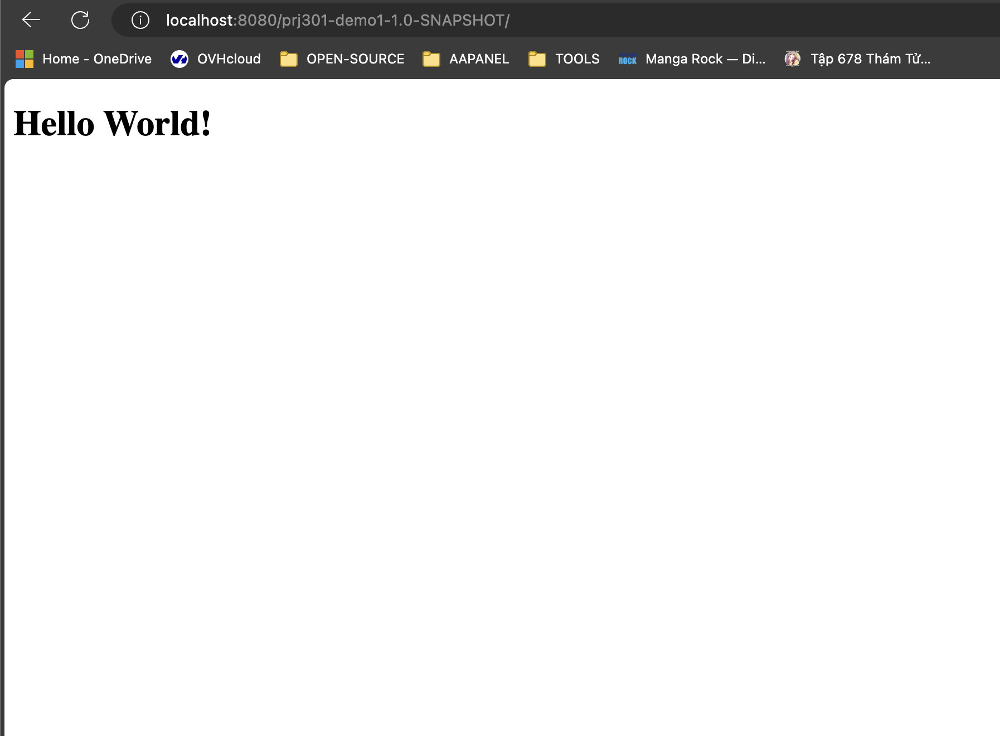
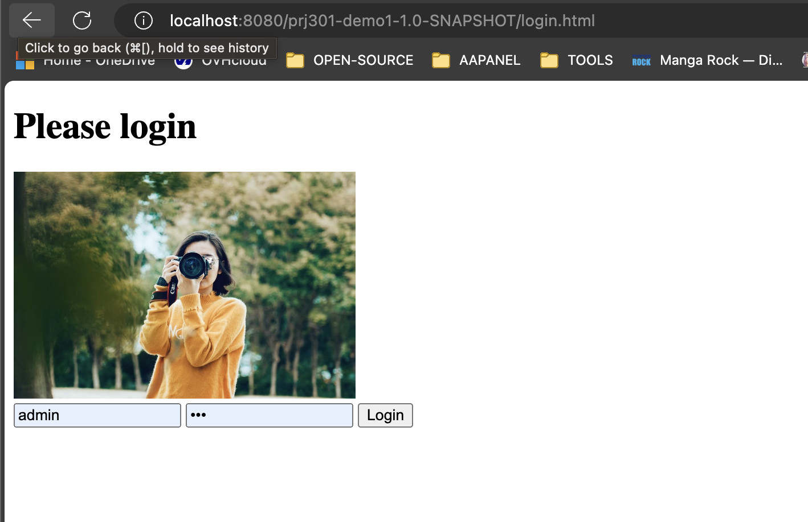
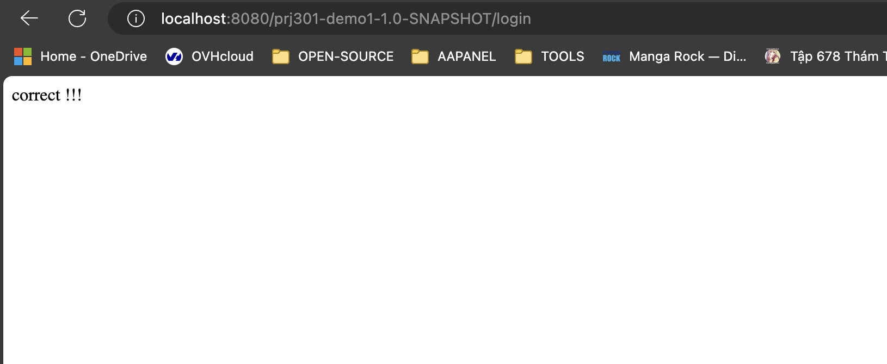
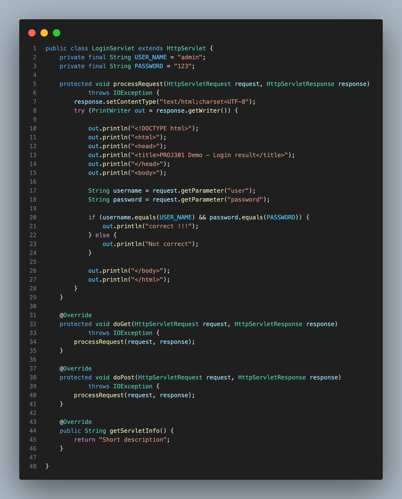
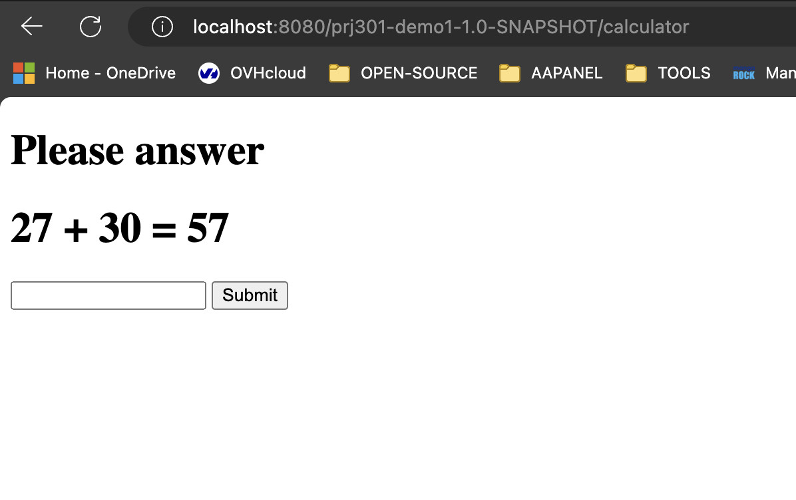
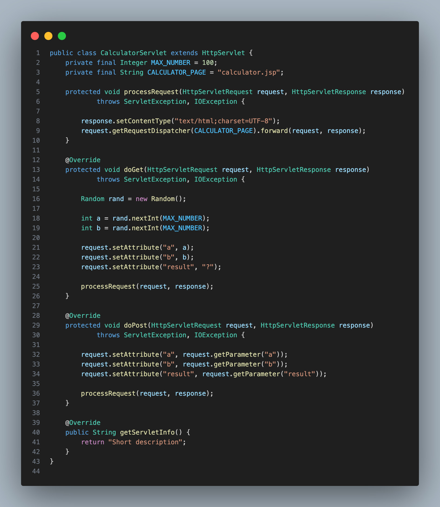

## Clean and build
```
mvn clean install && cp target/prj301-demo1-1.0-SNAPSHOT.war /opt/homebrew/Cellar/tomcat@8/8.5.97/libexec/webapps && catalina start
```

## Start Tomcat
```
catalina start
```


## Screenshort
















